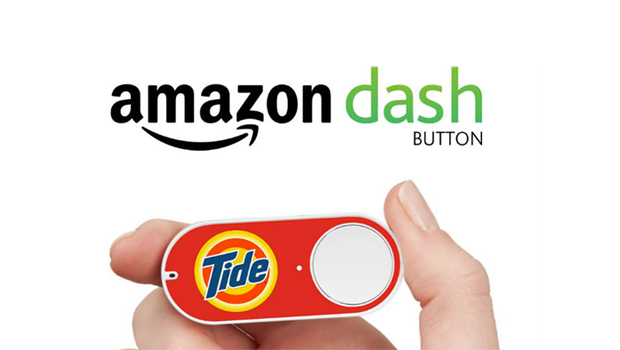

Node-Dash-Button-Webtasks
===================

Here is how I am using [Amazon Dash Button](http://www.amazon.com/oc/dash-button) as panic button. 

This setup utilize backend less [webtask](https://webtask.io/) cloud platform to securely send text messages when button is pressed. 
[Amazon Dash Button](http://www.amazon.com/oc/dash-button) triggers [webtask](https://webtask.io/) to send text message when button is pressed.



PS: You need to install `Scapy tool` on Mac or Raspberry PI to run the python script. 

```bash 
npm install wt-cli -g

wt create send_text.js --name send_text -s TWILIO_ACCOUNT_SID=aaa -s TWILIO_AUTH_TOKEN=aaa -s TWILIO_NUMBER=+15005550006
 
sudo python run.py
```

